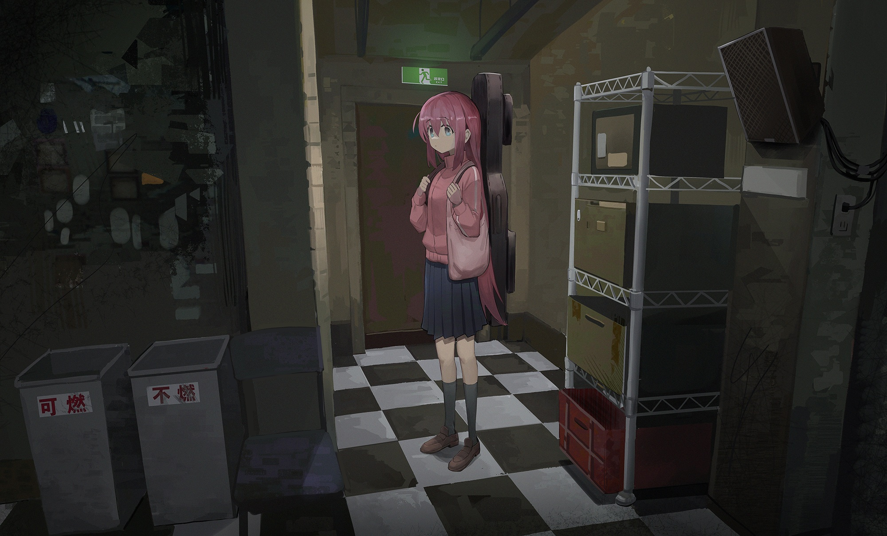

<h1>WALLPAPERS</h1>
<b>Weebs</b> wallapers that i use 
 

## If you are the original creator and would like for me to remove your work, please let me know.
Format: jpg, png 

### Feel free to contribute adding more

<h1>Examples</h1>
<h2> rice.jpg</h2>

<h2>something-something-girl.jpg</h2>

<h2> calabera-laka-laka.png</h2>  

<h2> snowy-day-girl.png</h2>  

